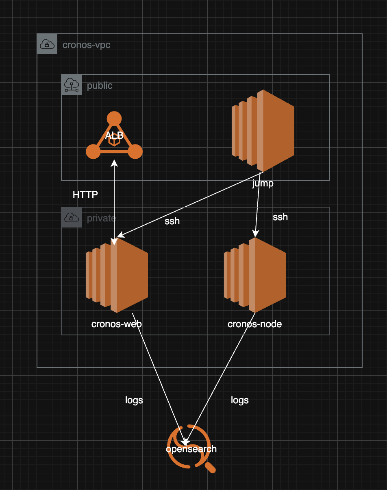

# aws-cronos
This repository contains all code required to complete crypto.com cronos assignment

## Architecture
The architecture of the solution is as follows:
- Setup infrastructure using terraform in AWS
- Setup a VPC with private and public subnets
- Private subnets can access internet services via NAT Gateway.
- (Optional): Setup network firewall to restrict outgoing traffic from cronos nodes
- Setup cronos nodes in private subnets to sync with cronos.org
- Setup cronos web server running Nginx to invoke rest and rpc apis from cronos.org
- Setup application load balancer in public subnet to route traffic to cronos web server
- Setup jump server in public subnet to ssh to  cronos nodes and web server



## Prerequisites
- AWS account and setup AWS configuration
- Terraform installed(tfenv)
- Terragrunt installed
- Docker installed

Export the following environment variables:
```bash
export AWS_ACCOUNT_ID=XX
export AWS_REGION=ap-southeast-1
```
## One Click Setup
```bash
./setup.sh v1.0.0
```

## Setup Details
* Build docker-cronos image
```shell
cd ${HOME_DIR}/docker-cronos
docker build --platform linux/amd64 -t ${AWS_ACCOUNT_ID}.dkr.ecr.${AWS_REGION}.amazonaws.com/cronos/cronos-node:${VERSION} .
```
* Build docker-web image
```shell
docker build --platform linux/amd64 -t ${AWS_ACCOUNT_ID}.dkr.ecr.${AWS_REGION}.amazonaws.com/cronos/cronos-web:${VERSION} .
```
* Create ECR and push images to ECR in AWS
```shell
terragrunt apply --auto-approve
#LOGIN to ECR
aws ecr get-login-password --region ${AWS_REGION} | docker login --username AWS --password-stdin ${AWS_ACCOUNT_ID}.dkr.ecr.${AWS_REGION}.amazonaws.com
#PUSH IMAGE TO ECR
#Use fixed version for production
docker push ${AWS_ACCOUNT_ID}.dkr.ecr.${AWS_REGION}.amazonaws.com/cronos/cronos-node:${VERSION}
docker push ${AWS_ACCOUNT_ID}.dkr.ecr.${AWS_REGION}.amazonaws.com/cronos/cronos-web:${VERSION}
```

* Setup network
```shell
cd ${HOME_DIR}/terraform/cronos/${AWS_REGION}/dev/network
terragrunt apply --auto-approve
```
* Setup EC2 key-pair
```shell
cd ${HOME_DIR}/terraform/cronos/${AWS_REGION}/dev/key-pair
terragrunt apply --auto-approve
#Setup EC2 key-pair-jump
cd ${HOME_DIR}/terraform/cronos/${AWS_REGION}/dev/key-pair-jump
terragrunt apply --auto-approve
```

* Setup jump-server
```shell
cd ${HOME_DIR}/terraform/cronos/${AWS_REGION}/dev/ec2-jump-server
terragrunt run-all apply --terragrunt-non-interactive --auto-approve
```

* Setup cronos-node
```shell
cd ${HOME_DIR}/terraform/cronos/${AWS_REGION}/dev/ec2-cronos-node
terragrunt run-all apply --terragrunt-non-interactive --auto-approve

```

* Setup cronos-web
```shell
cd ${HOME_DIR}/terraform/cronos/${AWS_REGION}/dev/ec2-cronos-web
terragrunt run-all apply --terragrunt-non-interactive --auto-approve
```
